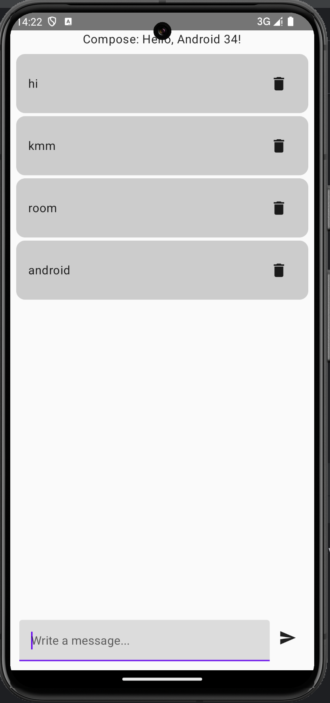
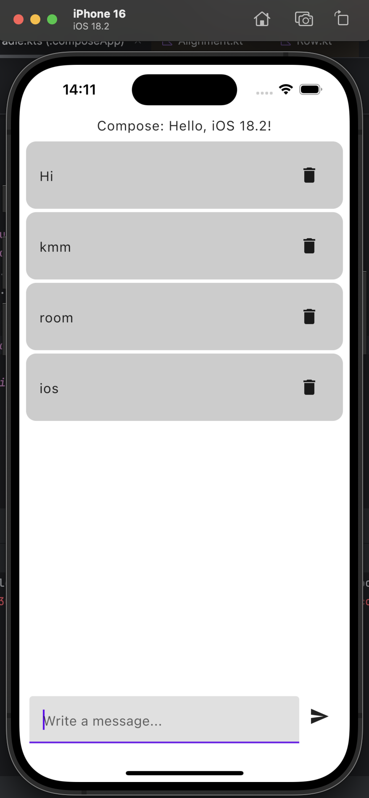
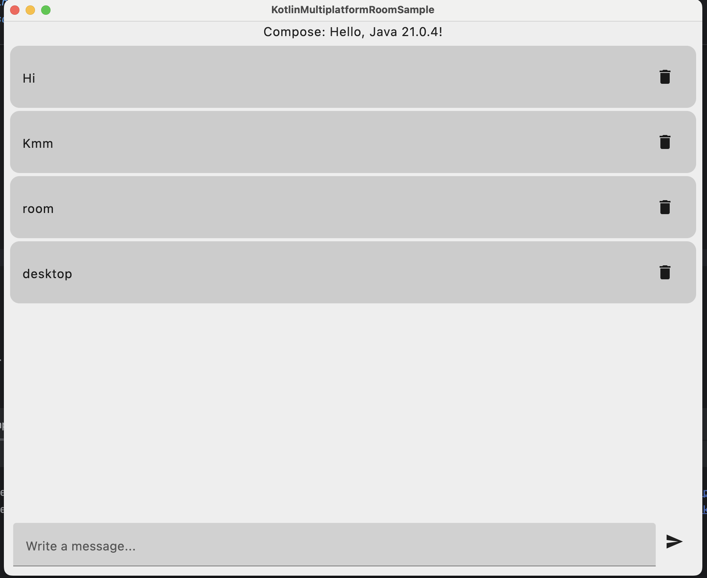

# Kotlin Multiplatform Room Sample

## 📌 Features

- **Kotlin Multiplatform** support
- **Room Database** for data persistence
- **Koin Dependency Injection**
- **Jetpack Compose UI for Android, iOS, and Desktop**
- **Coroutines & Flow** for async operations

## 🛠️ Tech Stack

- **Kotlin Multiplatform (KMM)**
- **Room Database** (KMM-supported)
- **Jetpack Compose** (Android, Desktop UI)
- **Koin** (Dependency Injection)
- **Room Database** is used on **Android, iOS, and Desktop** with SQLite as the underlying storage.
- **Kotlin Coroutines & Flow** (Reactive Data Handling)

## 📦 Project Structure

```
├── androidMain/    # Android-specific implementation
├── iosMain/        # iOS-specific implementation
├── desktopMain/    # Desktop-specific implementation
├── commonMain/     # Shared Kotlin Multiplatform Code
│   ├── db/         # Room Database & DAO (Shared across platforms)
│   ├── repository/ # Repository Layer
│   ├── di/         # Dependency Injection (Koin)
│   ├── App.kt      # Compose UI
│   ├── AppViewModel.kt # ViewModel (State Management)
```

## 🚀 Getting Started

### 1️⃣ Clone the repository

```sh
git clone https://github.com/ArtsiomBulatkin/KotlinMultiplatformRoomSample.git
cd KotlinMultiplatformRoomSample
```

### 2️⃣ Open in Android Studio

- Open **Android Studio** (latest stable version with KMM support)
- Select "**Open an Existing Project**"
- Choose the cloned repository folder
- Let Gradle sync the project

### 3️⃣ Run on Different Platforms

#### ✅ **Android**

- Select `composeApp` configuration
- Click **Run** ▶️ in Android Studio

#### ✅ **iOS**

- Open `iosApp` in **Xcode**
- Run on **iOS Simulator**

#### ✅ **Desktop**

- Select `desktop` configuration in Android Studio
- Click **Run** ▶️

## 📸 Screenshots

Here are some screenshots of the project running on different platforms:

### Android


### iOS


### Desktop


## 🏷️ Suggested GitHub Tags

- `Kotlin`
- `Kotlin-Multiplatform`
- `KMM`
- `Room-Database`
- `Android`
- `iOS`
- `Desktop`
- `Jetpack-Compose`
- `SQLite`
- `Coroutines`
- `Flow`
